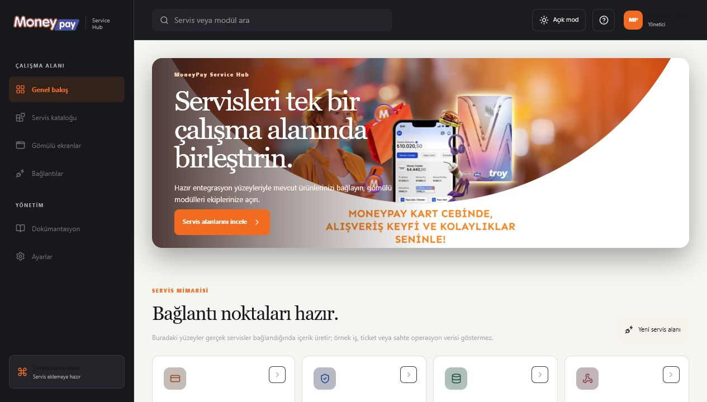

# THE Support Console

A synthetic customer-support and service-observability console for investigating account journeys, tracing incidents, and running controlled recovery workflows from one operational workspace.

[Open the live console](https://northline-support-ops.hsnkrgd.chatgpt.site)



## Capabilities

- 100 internationally named synthetic customer profiles
- End-to-end authentication, payment, balance, refund, and device-trust event streams
- Wallet and employee-benefit card assignments, including blocked and unassigned scenarios
- Daily and weekly service telemetry with event-level request diagnostics
- Controlled resolution workflows for balance discrepancies, captured funds, security locks, entitlement sync, and pending refunds
- Persistent light and dark themes
- Responsive desktop, tablet, and mobile layouts
- WCAG AA-conscious contrast, keyboard navigation, and Lucide outline icons

## Design system

- Primary: Solar Orange `#E84B2C`
- Neutral: Obsidian `#17181B`
- Accent: Radar Teal `#31D6B5`
- Display typeface: Georgia
- Interface typeface: Segoe UI
- Spacing scale: `8 / 16 / 24 / 32 / 48 / 64 / 96`

## Technology

- React 19
- TypeScript
- Vinext / Vite
- Tailwind CSS
- Lucide React
- Cloudflare-compatible worker output

## Local development

Node.js `22.13.0` or newer is required.

```bash
npm install
npm run dev
```

Production build:

```bash
npm run build
```

## Project structure

```text
app/
  page.tsx        Console interface, data scenarios, and interactions
  globals.css     Core layout and responsive styles
  branding.css    THE visual system and light/dark theme treatment
public/           Brand assets and favicon
worker/           Cloudflare-compatible application entry point
docs/screenshots/ Repository preview assets
```

## Data and brand notice

THE Support Console is an independent prototype built entirely with synthetic data. It is not connected to any real company, product, customer, or production service.

## License

This repository is shared for portfolio and prototyping purposes.
