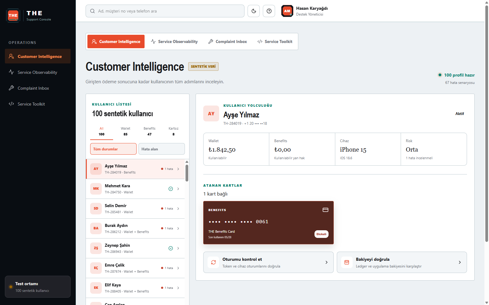
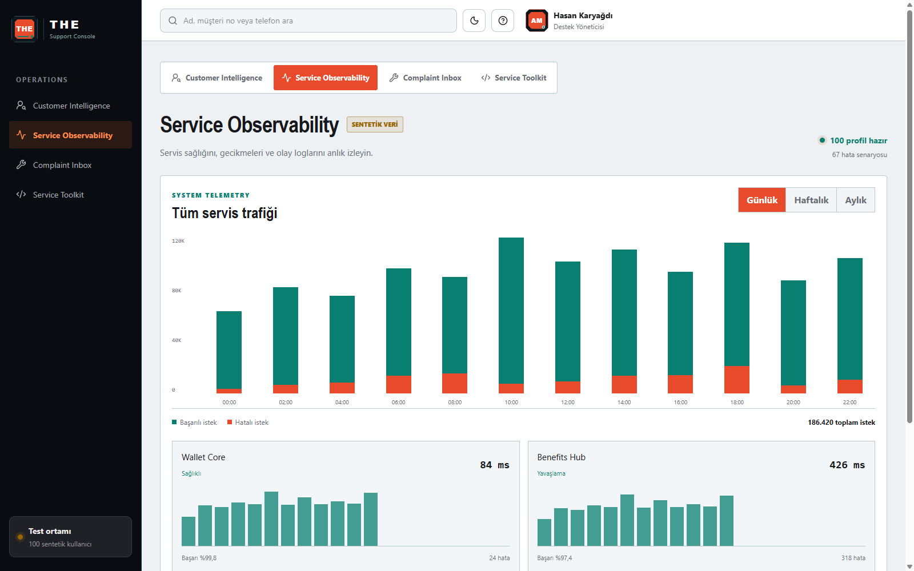
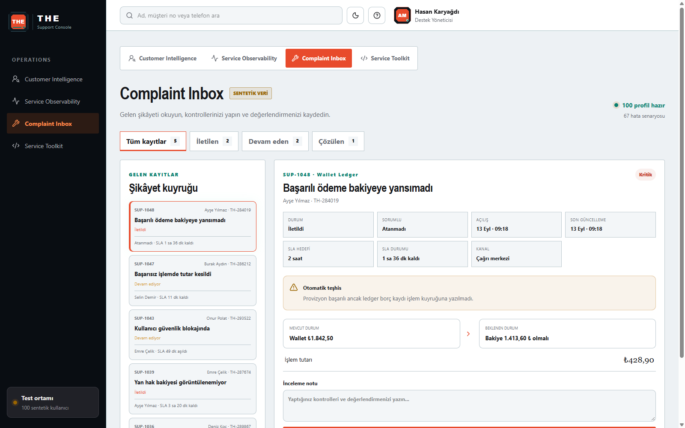
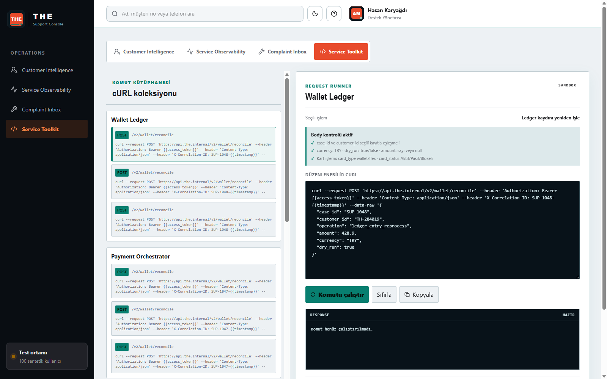

# THE Support Console

THE Support Console; destek ekiplerinin sentetik müşteri kayıtlarını inceleyebildiği, servis sağlığını takip edebildiği, şikâyet kayıtlarını yönettiği ve kontrollü cURL operasyonları çalıştırabildiği birleşik bir operasyon panelidir.

> Bu proje yalnızca sentetik veriler kullanır. Gerçek müşteri, şirket veya üretim servisiyle bağlantısı yoktur.

[Canlı paneli aç](https://northline-support-ops.hsnkrgd.chatgpt.site)

## Support olarak neyi vurguluyoruz?

Bu panelin odağı yalnızca hatayı göstermek değil, destek uzmanının bir müşteri sorununu baştan sona kanıtlarla inceleyip kontrollü biçimde çözüme ulaştırmasıdır.

Özellikle şu noktaları vurguluyoruz:

- **Tek müşteri görünümü:** Kullanıcının kimliği, cihazı, bakiyesi, kartları, ödemeleri ve servis logları farklı ekranlarda kaybolmadan aynı kayıt altında birleşir.
- **Kanıta dayalı inceleme:** Destek uzmanı işlem tutarını, hata kodunu, trace ID’yi, servis gecikmesini ve zaman sırasını birlikte görür.
- **Sorun ile çözümün ayrılması:** Complaint Inbox yalnızca gelen kaydı ve SLA sürecini gösterir; hangi servisin çalıştırılacağına destek uzmanı karar verir.
- **Kontrollü müdahale:** Service Toolkit içindeki cURL body serbestçe düzenlenebilir; ancak yanlış müşteri veya kayıt üzerinde işlem yapılmasını önlemek için ilişkiler doğrulanır.
- **Uçtan uca izlenebilirlik:** Başarılı müdahale kullanıcının bakiyesine, kart/hesap durumuna, olay loguna ve şikâyet kaydına birlikte yansır.
- **Operasyon güvenliği:** Gerçek servislere geçmeden önce aynı akış sentetik sandbox verisi üzerinde denenebilir ve `before/after` sonucu görülebilir.

## Hangi sorunları çözüme kavuşturuyoruz?

| Kullanıcı sorunu | Kontrol edilen kanıt | Uygulanan çözüm | Beklenen sonuç |
|---|---|---|---|
| Ödeme başarılı fakat bakiye düşmemiş | Ödeme tutarı, ledger kaydı, Wallet bakiyesi ve trace ID | Ledger kaydını yeniden işleme veya bakiyeyi yeniden hesaplama | Bakiye doğru tutara gelir ve işlem loglanır |
| İşlem başarısız olmasına rağmen tutar kesilmiş | Orchestrator sonucu, kesilen tutar ve ters işlem durumu | Ters işlem oluşturma | Kesilen tutar Wallet’a iade edilir |
| İade onaylandığı halde beklemede kalmış | Refund durumu, alacak kaydı ve işlem tutarı | İadeyi yeniden deneme | İade tutarı Wallet bakiyesine aktarılır |
| Kullanıcı güvenlik nedeniyle bloklanmış | OTP denemeleri, risk sonucu ve hesap durumu | Güvenlik blokesini kaldırma | Hesap yeniden aktif olur |
| Kart blokeli veya yanlış durumda | Kart tipi, son dört hane ve mevcut durum | `card_status_update` ile Aktif/Pasif/Blokeli güncellemesi | Yeni kart durumu tüm kullanıcı ekranlarına yansır |
| Benefits bakiyesi görünmüyor | Hak tahsisi, önbellek ve mevcut Benefits bakiyesi | Hakları senkronize etme | Kullanılabilir hak bakiyesi doğru görünür |
| Oturum veya cihaz doğrulaması başarısız | Oturum logları, cihaz bilgisi, token ve risk kodu | Oturum kontrolü, aktif oturumları sonlandırma veya yeni OTP | Kullanıcı güvenli biçimde yeniden giriş yapabilir |

## Support çözüm akışı

```text
1. Şikâyeti al
        ↓
2. Kullanıcıyı ve SLA süresini doğrula
        ↓
3. Olay akışı, ödeme, kart ve servis loglarını incele
        ↓
4. Uygulanacak servisi destek uzmanı olarak seç
        ↓
5. cURL body içindeki kayıt, müşteri ve işlem alanlarını doğrula
        ↓
6. Kontrollü işlemi çalıştır
        ↓
7. before/after sonucunu ve yeni kullanıcı logunu kontrol et
        ↓
8. Şikâyeti çözüldü durumuna taşı ve denetim izini koru
```

## Ana kategoriler

### 1. Customer Intelligence

100 sentetik kullanıcıyı tek bir dizinde toplar. Kullanıcı seçildiğinde kimlik ve iletişim bilgileri, Wallet ve Benefits bakiyeleri, cihaz/risk durumu, atanmış kartlar ve uçtan uca olay akışı birlikte görüntülenir.

- Ad, müşteri numarası ve telefonla arama
- Hata alan kullanıcıları filtreleme
- Wallet, Benefits ve kartsız kullanıcı sekmeleri
- Aktif, pasif ve blokeli kart durumları
- Giriş, ödeme, bakiye, hata ve destek işlemi logları
- Tutar, servis, trace ID, gecikme ve hata kodu ayrıntıları
- Service Toolkit işlemlerinin kullanıcı zaman çizelgesine anlık yansıması



### 2. Service Observability

Kullanıcı bazlı kayıt göstermeden tüm sistemin servis trafiğini izler. Günlük, haftalık ve aylık görünüm üzerinden istek hacmi, hata oranı ve servis gecikmeleri karşılaştırılır.

- Başarılı ve hatalı istek dağılımı
- Günlük, haftalık ve aylık zaman aralığı
- Wallet Core, Benefits Hub, Mobile Gateway ve Identity & Risk servisleri
- Servis bazlı gecikme, başarı oranı ve hata sayısı
- Sistem genelini gösteren grafikler; kullanıcı verisi içermez



### 3. Complaint Inbox

Destek kayıtlarının okunması ve operasyonel takibi için ayrılmıştır. Grafik veya servis çalıştırma aracı içermez; şikâyet ve SLA bilgisine odaklanır.

- İletilen, devam eden ve çözülen kayıt filtreleri
- Kayıt sahibi, sorumlu kişi, kanal, tarih ve saat
- SLA hedefi, kalan süre ve aşım durumu
- Otomatik teşhis
- Mevcut durum ile beklenen durum karşılaştırması
- İşlem tutarı ve inceleme notu
- Service Toolkit’te başarıyla tamamlanan işlemin çözüldü durumuna yansıması



### 4. Service Toolkit

Hazır cURL koleksiyonunu kontrollü bir sandbox çalışma ortamında çalıştırır. Sol tarafta servis komutları, sağ tarafta düzenlenebilir komut editörü, doğrulama sonucu, response ve çalışma geçmişi bulunur.

- Düzenlenebilir cURL ve JSON body
- `case_id` ile seçili şikâyet kaydının eşleşme kontrolü
- `customer_id` ile kayıt sahibinin eşleşme kontrolü
- `amount`, `currency`, `dry_run` ve `operation` alan doğrulamaları
- Kart işlemlerinde `card_type` ve `card_status` doğrulaması
- `Aktif`, `Pasif` ve `Blokeli` kart durumları
- Başarılı işlemlerde `before` / `after` veri karşılaştırması
- Hatalı body için ayrıntılı `422 SANDBOX_VALIDATION_FAILED` yanıtı
- Son altı komutun HTTP durumuyla çalışma geçmişi
- Başarılı işlemin kullanıcı bakiyesine, kartına, hesabına, loglarına ve şikâyet durumuna yansıması



## Bağlı sandbox veri modeli

Panelde kullanıcı, kart, şikâyet ve servis komutu birbirinden bağımsız demo blokları değildir. Hepsi aynı tarayıcı oturumundaki merkezi sandbox kaydını kullanır.

```text
Complaint Inbox kaydı
        │
        ├── case_id
        └── customer_id
                │
                ▼
Service Toolkit doğrulaması ──► Sandbox işlemi
                                      │
                   ┌──────────────────┼──────────────────┐
                   ▼                  ▼                  ▼
             Kullanıcı bakiyesi   Kart/hesap durumu   Olay logu
                   │                  │                  │
                   └──────────────────┴──────────────────┘
                                      │
                                      ▼
                         Tüm kategorilerde yeni durum
```

### Desteklenen örnek operasyonlar

| Operation | Sandbox etkisi |
|---|---|
| `ledger_entry_reprocess` | İşlem tutarını Wallet bakiyesine uygular |
| `balance_recalculate` | Bakiye kontrol akışını ve denetim logunu çalıştırır |
| `reversal_create` | Kesilen tutarı Wallet bakiyesine iade eder |
| `refund_retry` | Bekleyen iadeyi Wallet bakiyesine aktarır |
| `benefits_reconcile` | Benefits bakiyesini istek tutarıyla eşitler |
| `account_unlock` | Blokeli hesabı aktif duruma getirir |
| `card_status_update` | Seçilen Wallet/Benefits kartını Aktif, Pasif veya Blokeli yapar |

## THE marka sistemi

- Geometrik THE amblemi: sol menü ve dar menü görünümü
- THE faviconu: tarayıcı sekmesi
- AM profil rozeti: aynı amblem ailesinin kullanıcı varyantı
- Açık ve koyu tema desteği
- Ana renk: Solar Orange `#E84B2C`
- Nötr: Obsidian `#17181B`
- Vurgu: Radar Teal `#31D6B5`
- Başlık karakteri: Arial Narrow / Segoe UI
- Gövde karakteri: Segoe UI
- Boşluk sistemi: `8 / 16 / 24 / 32 / 48 / 64 / 96`

## Güvenlik sınırı

Service Toolkit şu anda gerçek servis adreslerine istek göndermez. Komutlar yalnızca ortak sentetik sandbox durumunu günceller. Üretim bağlantısı için servis adresleri, authentication yöntemi, rol/yetki politikası, onay akışı ve kalıcı denetim kaydı ayrıca bağlanmalıdır.

## Teknoloji

- React 19
- TypeScript
- Vinext / Vite
- Lucide React outline ikonları
- Cloudflare uyumlu worker çıktısı

## Yerel geliştirme

Node.js `22.13.0` veya üzeri gereklidir.

```bash
npm install
npm run dev
```

Üretim derlemesi:

```bash
npm run build
```

## Proje yapısı

```text
app/
  page.tsx               Veri senaryoları, kategoriler ve etkileşimler
  globals.css            Temel yerleşim ve responsive kurallar
  branding.css           THE renk ve tema sistemi
  brand-logo.css         THE amblemi ve AM profil rozeti
  observability.css      Sistem grafiklerinin görünümü
  complaints.css         Şikâyet çalışma alanı
  service-runner.css     cURL editörü, response ve çalışma geçmişi
  state-sync.css         Ortak durum göstergeleri
public/
  favicon.svg            THE tarayıcı simgesi
docs/
  CHANGELOG.md           Son geliştirmelerin tarihli özeti
  screenshots/           Güncel kategori ekran görüntüleri
```

## Lisans ve kullanım

Bu depo portföy, prototipleme ve destek operasyonu tasarımı amacıyla paylaşılmıştır.
