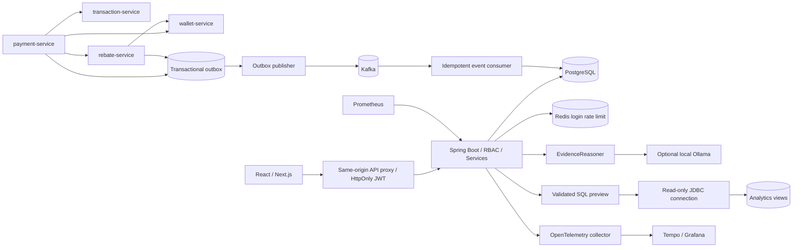

# Mimari kararlar

## Katmanlar

- `controller`: HTTP binding/validation; business logic servislerde.
- `security`: BCrypt, HS256 JWT, stateless RBAC, Redis login rate limit.
- `domain` / `repository`: 10 JPA entity ve UserRepository; investigation read modellerinde explicit parametrik JDBC projeksiyonları.
- `dto`: Typed request/preview/timeline/analysis sözleşmeleri. Aggregate read response'ları SQL kolonlarından oluşturulan map projeksiyonlarıdır; JPA entity'leri serialize edilmez.
- `service`: transaction family, timeline merge, incident state transitions, dashboard ve investigation orkestrasyonu.
- `ai`: closed SQL grammar, template/model SQL generator, supported evidence patterns, narrator, similarity extension point.
- `audit`: Incident değişiklikleriyle aynı transaction'a katılan audit; başarısız query'nin rollback'inden bağımsız query audit.
- `integration`: LogSource/Postgres, HTTP simulator, outbox ve Kafka consumer.
- `config`: repeatable empty-database demo bootstrap.

## Temel kararlar

**Modüler monolith:** Investigation read model tek veritabanında toplanır. Mikroservislerin failure mode'ları simulator container'larıyla gösterilir; ana platformu gereksiz dağıtmak yerine tutarlılık basitleştirilir.

**Original/rebate family:** Recursive CTE, yönü iki taraflı rebate ilişkilerini çözer. UNION cycle tekrarını önler. Kaynak başına 1.001 kayıt okunarak 1.000 sınırının aşılması tespit edilir. API `truncated` bilgisini verir; eksik delille analysis oluşturulmaz. Timestamp eşitliğinde UUID, deterministik tie-breaker'dır. UUID olaylar arası nedensellik kanıtı değildir.

**İşlem zamanı:** Veritabanında `timestamptz`, DTO'da UTC `Instant`/ISO-8601, arayüzde kullanıcının local saat dilimi kullanılır. Gerçek servis saat kaymaları için ingestion zamanı + event zamanı ayrımı sonraki aşamadır.

**Event reliability:** Business record ve outbox aynı DB transaction'ında yazılır. Publisher row lock/SKIP LOCKED ile pending kayıt alır. Kafka ack sonrası published işaretlenir. Ack ile DB commit arasındaki crash aynı event'i yeniden publish edebilir; consumer event ID unique constraint ile dedupe eder. Exactly-once iddiası yoktur.

**SQL boundary:** Kullanıcı/model string'i doğrudan uygulama datasource'una gitmez. Exact grammar → owned expiring preview → tekrar validation → reader datasource. View whitelist kullanıcı/parola ve raw request body erişimini dışarıda bırakır. DB read-only rolü tek başına pahalı SELECT'leri engellemediği için fonksiyon/CTE/JOIN whitelist dışındadır.

**Auth:** Same-origin proxy sadece tanımlı API yollarını forward eder; hedef host environment'dan sabittir. Mutasyonlarda Origin eşleşmesi aranır. JWT HttpOnly, SameSite=Strict; HTTPS'de Secure. UI'daki role gizleme kolaylıktır; yetki Spring Security'de zorunlu kılınır. Audit ADMIN'e ayrılmıştır. BFF'den API'ye login rate limit tüm kullanıcılar için ortak proxy adresinde çalışır; local demo için bilinçli basit sınırdır.

**AI truthfulness:** Verilen confidence skorları heuristic'tir. Evidence olmadan desteklenen root cause üretilmez. Timeout bulgusu downstream başarısızlığını kesinleştirmez. LLM yalnızca öneri üretir; kullanıcı review ve query execution düğmesi zorunludur. Model SQL'i gramerden geçse dahi anlamsal doğruluk insan değerlendirmesi gerektirir.

## Production'a geçiş planı

1. Gerçek kaynak kontratları, PII redaction, tenant/RLS, RBAC ve audit retention politikaları.
2. SSO/OIDC, refresh/revocation, secret management, TLS ve rate-limit identity propagation.
3. Elasticsearch indeks adaptörü, retention, pagination ve event-time/ingest-time ayrımı.
4. Kafka DLQ/redrive, outbox retry metadata ve dashboard, broker HA/rebalance/load test.
5. Etiketli incident evaluation dataset, model semantic eval, prompt-injection testleri, embedding index ve model gözlemlenebilirliği.
6. CI deployment, image digest/CVE kontrolü, migrations rollback stratejisi, backup/restore ve disaster recovery provası.
